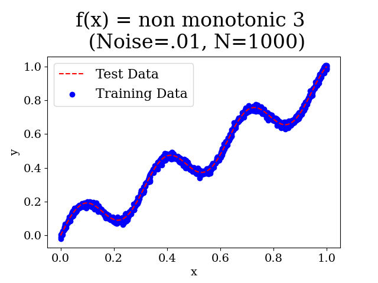
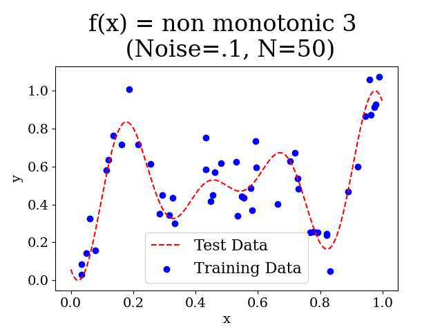

# Synthetic univariate  "toy-example" datasets
Experiments import generate1D() function, which is defined here. 
- It allows for adding Gaussian noise to the generated data. 
- The x values can either be uniformly spaced or randomly selected within a specified range. 
- The function returns the generated x and y values.
- example datasets:

  
   

