# Towards Trustworthy AI: An Evaluation of Recent Approaches to Constrain Neural Networks with Monotonicity

---

Repository which contains the master thesis code.

## Abstract:
Neural networks have gained prominence for their ability to model complex functions 
without making explicit assumptions. However, many real-world applications in 
natural sciences, engineering or healthcare entail prior knowledge of monotonic input-output relationships. By constraining neural networks with this domain knowledge, 
its decision-making process becomes more interpretable and trustworthy again, while 
its predictions can improve in fairness. Further, in cases of noisy or limited data, 
monotonicity constraints have the potential to improve generalizability, broadening 
the scope of application for these powerful models. This study compares various 
recent methods for partial monotonic networks. The evaluation comprises a wide 
range of (benchmark) target functions, such as step and smooth functions, uni- and 
multivariate functions across scenarios of noisy or low-quality training data. This 
study demonstrates that the regularization effect of monotonicity constraints allows 
multiple methods to compare competitively with unconstrained Multilayer 
Perceptrons, or even outperform them. Interestingly, lightweight architectural 
constraints demonstrate superior performance, effort and usability over soft-constrained learning techniques or overly complex methodologies. Although 
monotonicity constraints always introduce longer training times, practitioners in 
relevant domains typically consider this a worthwhile trade-off for the assurances of 
monotonic behavior. Machine learning practitioners are encouraged to acquaint 
themselves with these novel techniques, potentially saving significant time and effort 
by utilizing this study as a foundation for information.

## Partially Monotonic Neural Networks

Currently implemented approaches:

- **Sill (1997): Min-Max Networks** | [Paper](https://proceedings.neurips.cc/paper_files/paper/1997/file/83adc9225e4deb67d7ce42d58fe5157c-Paper.pdf)
- **Liu et al. (2020): Certified Monotonic Neural Networks** | [Paper](https://arxiv.org/abs/2011.10219)
- **Sivaraman et al. (2020): Counterexample-Guided Monotonic Neural Networks** | [Paper](https://proceedings.neurips.cc/paper/2020/file/8ab70731b1553f17c11a3bbc87e0b605-Paper.pdf) | MIT License, Copyright &copy; 2020 Aishwarya Sivaraman
- **Runje & Shankaranarayana (2023): Constrained Monotonic Neural Network** | [Paper](https://arxiv.org/abs/2205.11775) | Attribution-NonCommercial-ShareAlike 4.0 International, Copyright &copy; 2023 Runje & Shankaranarayana
- **Nolte et al. (2023): Expressive Monotonic Neural Networks** | [Paper](https://arxiv.org/pdf/2307.07512.pdf) | MIT License, Copyright &copy; 2023 Ouail Kitouni, Niklas Nolte

## Univariate Approximation results:

<kbd>CLICK</kbd> sigmoid10: 

  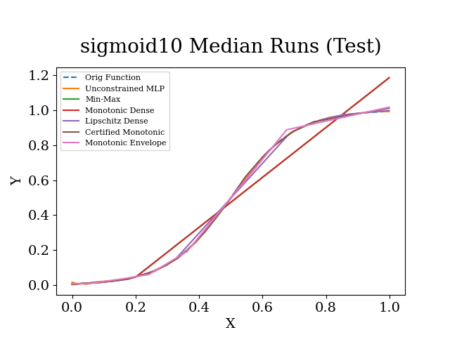

[//]: # (  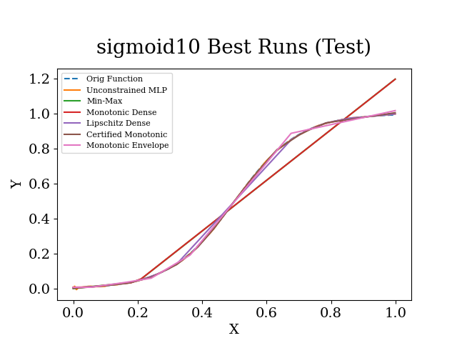)

[//]: # (  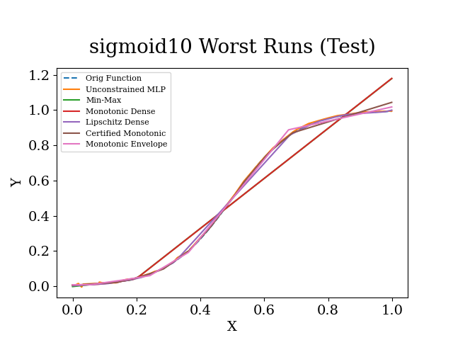)

<kbd>CLICK</kbd> square: 

  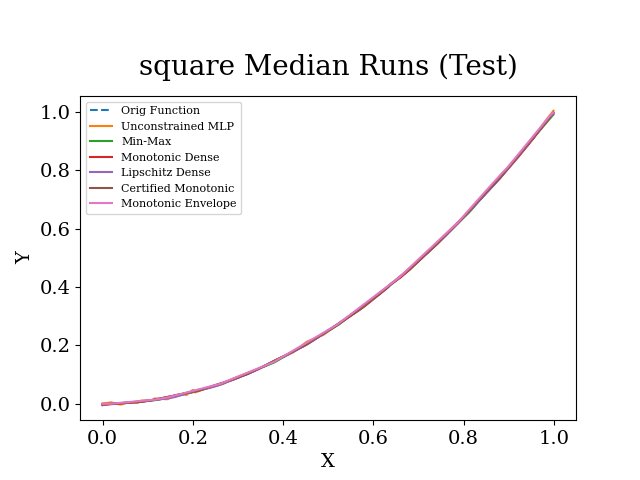

[//]: # (  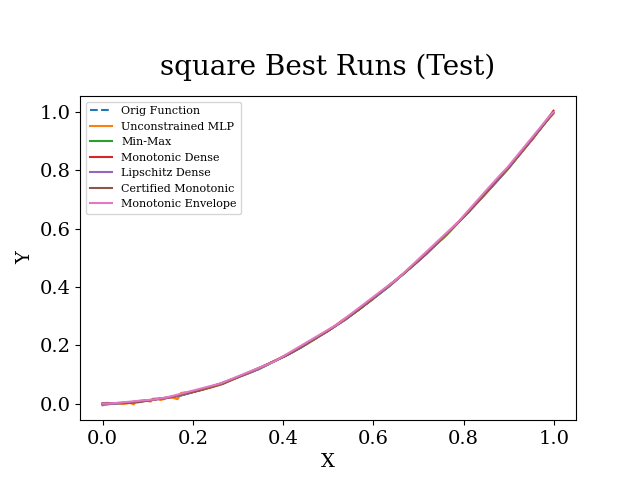)

[//]: # (  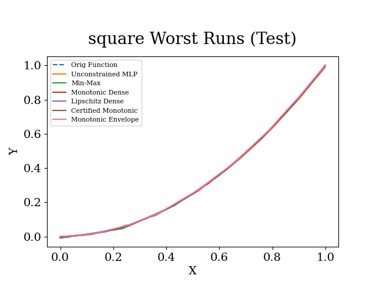)

<kbd>CLICK</kbd> square root: 

  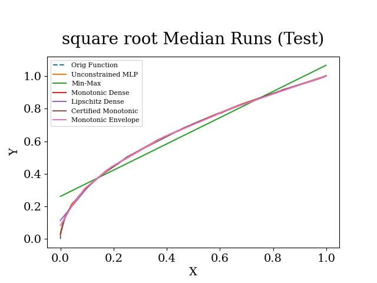

[//]: # (  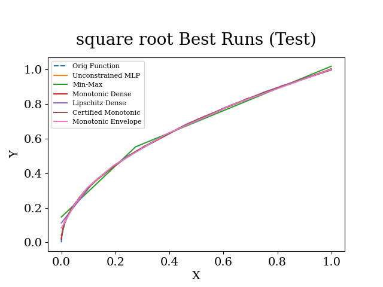)

[//]: # (  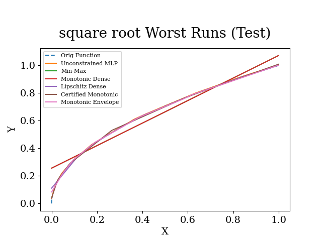)

<kbd>CLICK</kbd> non smooth: 

  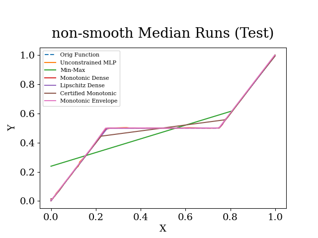

[//]: # (  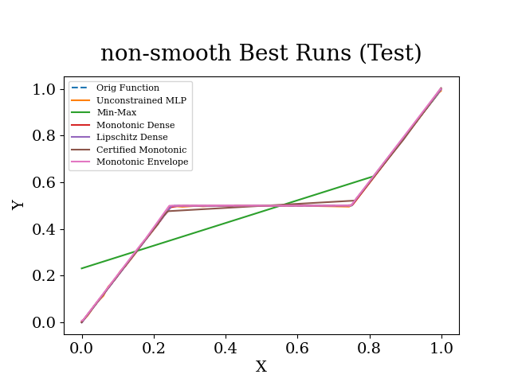)

[//]: # (  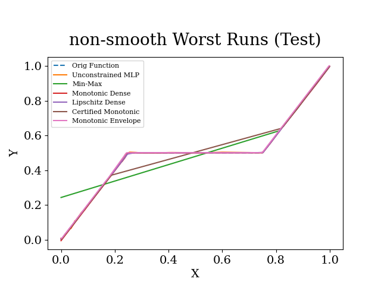)

<kbd>CLICK</kbd> non monotonic 1: 

  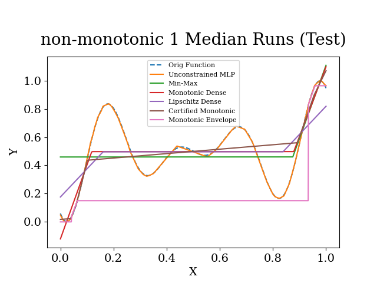

[//]: # (  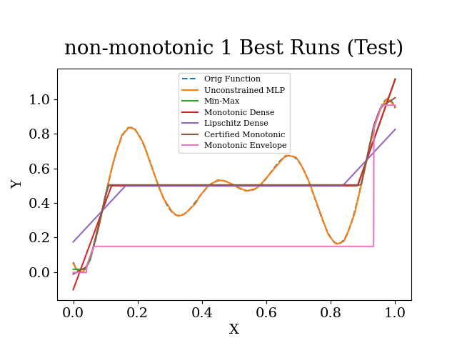)

[//]: # (  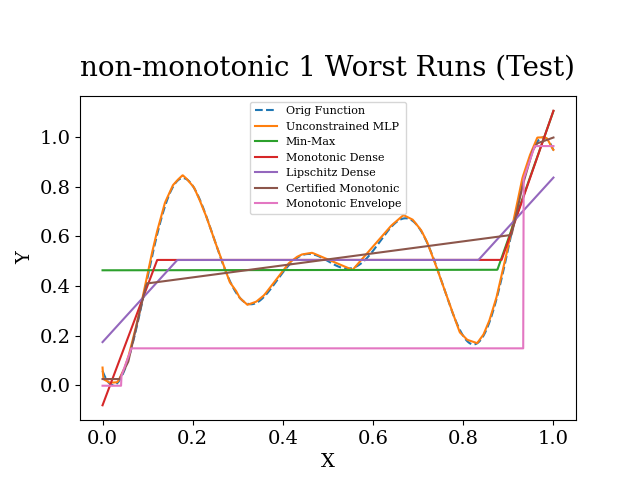)

<kbd>CLICK</kbd> non monotonic 2: 

  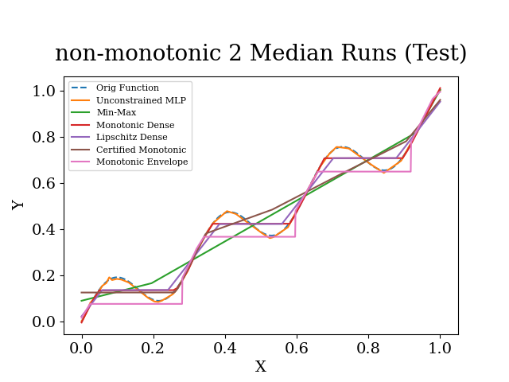

[//]: # (  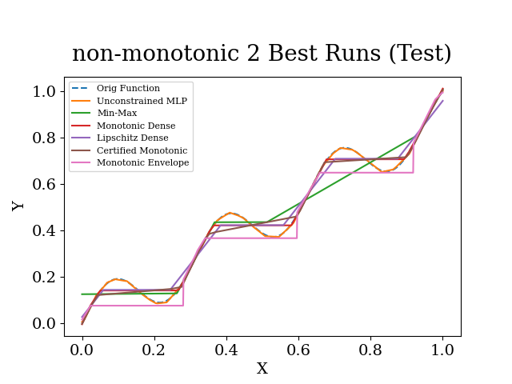)

[//]: # (  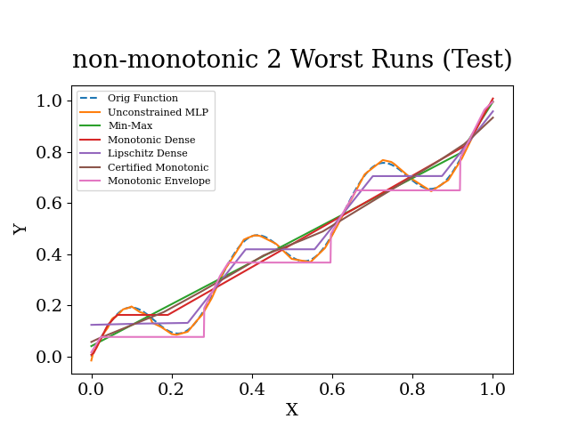)

<kbd>CLICK</kbd> non monotonic 3: 

  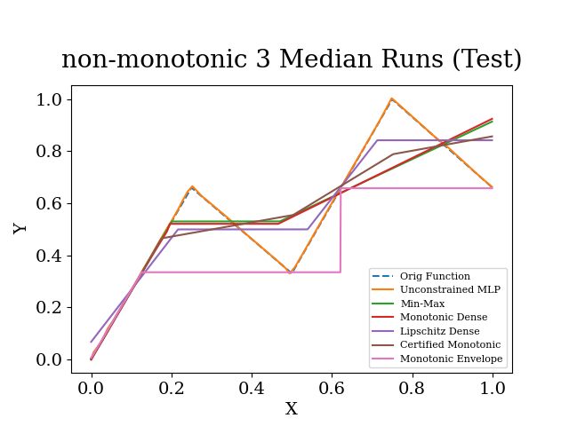

[//]: # (  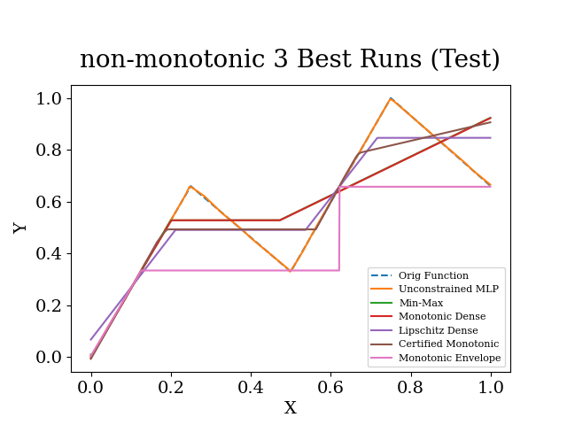)

[//]: # (  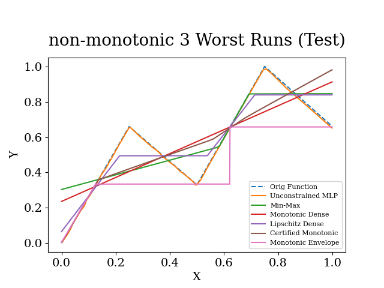)

## Multivariate Benchmark results:

Energy Efficiency [Dataset](https://archive.ics.uci.edu/dataset/242/energy+efficiency) - Regressing the **heating load (y1)** given:

Relative Compactness, Surface Area, **Wall Area**, Roof Area, **Overall Height**, Orientation, **Glazing Area**, Glazing Area Distribution,

where bold features are constrained monotonic.

<kbd>CLICK</kbd> Avg Test MSE of 5-fold cross validation results 

  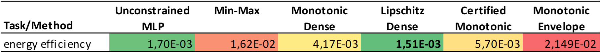

<kbd>CLICK</kbd> Standard deviation of Test MSE 

  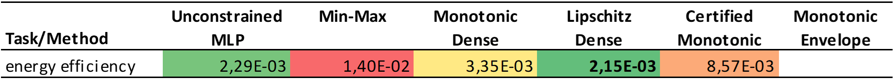

<kbd>CLICK</kbd> Avg train & inference time 

  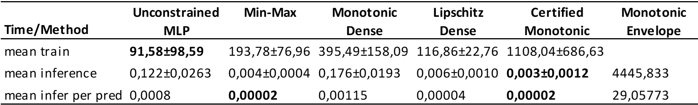

